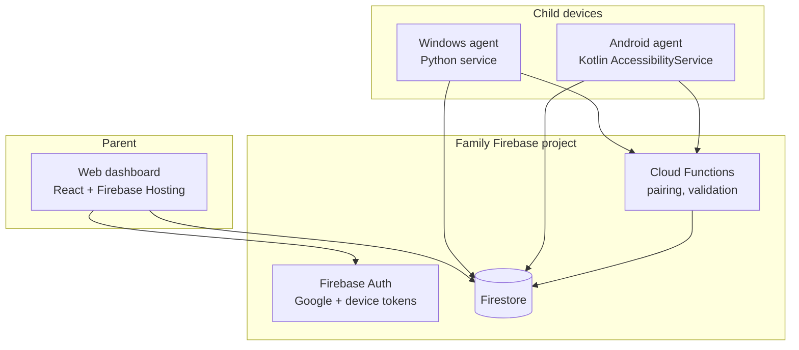

# Screen Time Control

Self-hosted parental screen-time management for **Windows** and **Android** child devices, with a **web dashboard** for parents. Each family uses its own Firebase project; agents enforce rules locally and sync usage via Firestore.

## Architecture



**Data flow:** Parents write rules and temp-unlocks in Firestore. Agents subscribe to `rules/current` and `temp-unlocks`, cache locally, and run an identical **rules engine** (TypeScript canonical, Python/Kotlin ports). Agents append **events** and **tamper-attempts**; a scheduled function writes **daily rollups** for cheap dashboard reads.

| Component | Stack | Path |
|-----------|--------|------|
| Web dashboard | React 18, Vite, TypeScript, Tailwind, Firebase Web SDK | `apps/web-dashboard` |
| Windows agent | Python 3.12, PyInstaller, UI Automation | `apps/windows-agent` |
| Android agent | Kotlin, Gradle CLI | `apps/android-agent` |
| Shared rules engine | TS + Python + Kotlin parity tests | `packages/shared-rules-engine` |
| Backend | Firestore rules, Cloud Functions | `firebase/` |

## Quickstart (parents)

1. Create a Firebase project; enable **Authentication** (Google), **Firestore**, **Functions**, and **Hosting**.
2. Deploy backend and dashboard (see `firebase/` and `apps/web-dashboard` READMEs when present).
3. Configure dashboard env vars (see `apps/web-dashboard/.env.example`); use emulators for local dev.
4. Sign in at the hosted dashboard URL; add a child and **pair** each device with a 6-character code.
5. Install agents from [GitHub Releases](https://github.com/YOUR_ORG/screen-time-control/releases) (verify `sha256:` in release notes).

Detailed steps: [docs/parent-guide.md](docs/parent-guide.md).

## Development

```bash
pnpm install
pnpm --filter @screen-time-control/web-dashboard dev
pnpm --filter @screen-time-control/web-dashboard build
pnpm test
```

Emulator-friendly dashboard config:

```bash
cp apps/web-dashboard/.env.example apps/web-dashboard/.env
# Set VITE_FIREBASE_USE_EMULATOR=true and emulator hosts
firebase emulators:start   # when firebase/ is set up
```

## Documentation

- [Parent guide](docs/parent-guide.md)
- [Troubleshooting](docs/troubleshooting.md)
- [Smoke checklist](docs/smoke-checklist.md)
- Design & data model: `openspec/changes/screen-time-control/design.md`

## CI / release

- **CI** (`.github/workflows/ci.yml`): `pnpm test`, rules parity, pytest, Gradle, emulator integration (skips missing packages).
- **build-windows.yml** / **build-android.yml**: agent artifacts.
- **release.yml**: tag `v*` → builds + GitHub Release with SHA-256 checksums.

## License

See repository license file when added.
