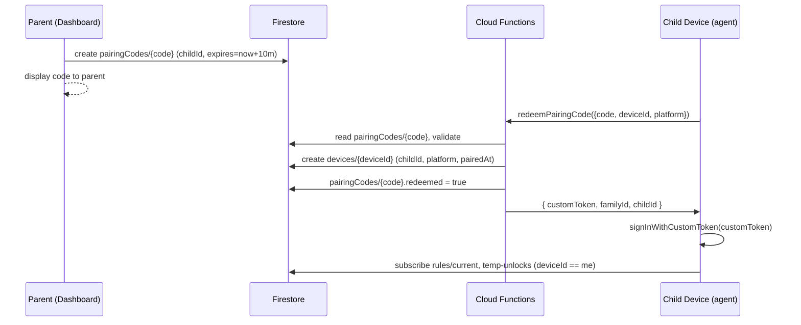
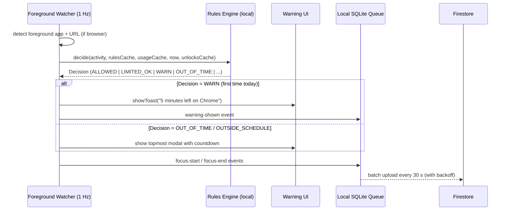
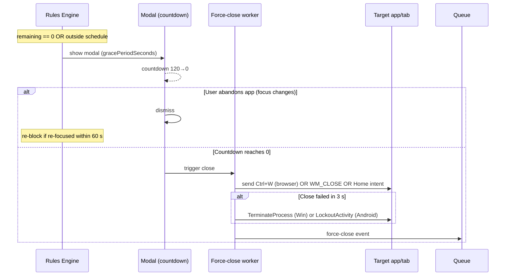

## Context

We are building a self-hosted parental screen-time control product targeting
two child platforms (Windows and Android) and a web dashboard for parents,
all backed by a per-family Firebase project. The product needs to be
implementable end-to-end by a coding agent in one pass, and must work
reliably with limited human intervention (no Android Studio, no commercial
MDM, no DPI proxy, no kernel drivers).

The project is greenfield: an empty repo with only OpenSpec scaffolding.
There is no prior code or migration concern.

The technically interesting parts are:

1. **Cross-runtime rule semantics.** The Windows agent (Python), the Android
   agent (Kotlin), and the dashboard (TypeScript) must all reach the same
   decision given the same inputs.
2. **Reliable foreground-activity observation** on two very different
   platforms — Windows UI Automation for browser URLs and Android
   AccessibilityService for both app and URL.
3. **Tamper resistance** against an intelligent child user without going to
   kernel-mode tricks or commercial-MDM dependencies.
4. **Firestore data model + security rules** that scope reads/writes
   correctly between the parent role (`parent`) and the device role
   (`device`), while keeping read fan-out cheap (daily rollups vs. raw
   events).

## Goals / Non-Goals

**Goals:**

- One coding-agent pass produces a working system, including CI builds for
  both child agents and a deployable dashboard.
- Identical enforcement semantics across Windows and Android (no
  per-platform surprises for the parent).
- Offline-tolerant agents (rules cached locally, events queued locally).
- Tamper resistance level "Strong" as defined in the proposal.
- Free-tier-friendly Firebase usage (Firestore reads dominated by rollups,
  not raw event scans).
- Open-source toolchains end-to-end; no proprietary IDEs in CI (Visual
  Studio, Android Studio).

**Non-Goals:**

- iOS / macOS / Linux child agents.
- Network-level filtering (no MITM, no VPN, no DNS).
- Multi-tenant SaaS.
- Real-time bidirectional commanding beyond Firestore listeners (no custom
  socket protocol).
- Internationalization.

## Decisions

### D1. Windows agent in Python 3.12 + PyInstaller

**Decision:** Use Python 3.12 with `pywin32` (Win32 API), `comtypes`
(UIAutomationCore COM), `psutil`, `pydantic` for validation, `firebase-admin`
for Firestore, `pystray` for tray UI, packaged with PyInstaller `--onefile`.
Run as a Windows Service via `pywin32`'s `win32serviceutil` (preferred over
NSSM since we already need pywin32 and it avoids the extra bundled binary).

**Alternatives considered:**
- Go + win32 syscalls: lighter binary, but the UIAutomation COM interface is
  far easier to consume in Python via `comtypes`, and the tray UI ecosystem
  is more mature in Python.
- .NET 8 self-contained: best Windows API ergonomics but the produced
  binaries are larger (~70 MB) and require .NET SDK in CI for cross-compile;
  also makes coding-agent iteration slower than Python.
- Rust + Tauri: too much code to write from scratch for COM bindings in one
  pass.

**Rationale:** Python is the most agent-friendly choice (one-shot generation
is straightforward), all needed APIs are accessible, PyInstaller produces
self-contained .exes installable as a service, and the binary footprint
(~25 MB) is acceptable.

### D2. Android agent in Kotlin + Gradle CLI

**Decision:** Pure Kotlin Android project built with the Android Gradle
Plugin via `./gradlew assembleRelease` (and `bundleRelease` for the AAB if
desired). Use the official Android command-line tools (`commandlinetools-linux`
in CI; locally users only need a JDK 17 + an `ANDROID_HOME` with the
command-line SDK installed via `sdkmanager`). No Android Studio anywhere in
the toolchain.

**Alternatives considered:**
- Flutter: would add a Dart layer for not much benefit and still requires
  the Android SDK.
- React Native: extra runtime, the native AccessibilityService still has to
  be written in Kotlin.
- Kotlin Multiplatform: unnecessary since we have no iOS target.

**Rationale:** AccessibilityService and DeviceAdminReceiver are deeply
native APIs; Kotlin is the path of least resistance and is fully usable
from CLI.

### D3. Web dashboard in React 18 + Vite + TS + Tailwind + shadcn/ui

**Decision:** React + Vite + TypeScript + Tailwind + shadcn/ui (Radix-based
primitives), Firebase Web SDK, `recharts` for graphs, deployed to Firebase
Hosting. State via React Context + `@tanstack/react-query` for Firestore
queries (with `react-firebase-hooks` for real-time subscriptions).

**Alternatives:** Next.js (overkill — no SSR/SEO needs), SvelteKit (smaller
ecosystem for shadcn-style component libraries).

### D4. Browser URL detection: UI Automation on Windows, Accessibility on Android

**Decision:** On Windows, read the address-bar value via `IUIAutomation`
COM. On Android, traverse the `AccessibilityNodeInfo` tree for the
browser's known `url_bar` resource id.

**Alternatives considered:** Browser extensions per browser — more accurate
on Firefox and resilient to UI changes, but multiply install friction (must
be installed in every browser, can be removed by child). We document
"browser, URL unknown" as a graceful fallback.

**Rationale:** Per the user's choice (`browser_tracking: ui_automation`),
extensions are not part of v1. We mitigate the flakiness risk with
per-browser strategies, a `url-read-failed` event, and the deterministic
fallback to the browser app's category.

### D5. Single Firebase project per family

**Decision:** Each family creates and owns its own Firebase project. The
dashboard, agents, and Cloud Functions all use that one project. No shared
backend.

**Trade-off:** Setup is more involved (parent must follow a guided setup
script to create the project, enable Auth/Firestore, deploy Functions). In
exchange, all child data lives in the parent's own GCP account, and there
is no operational burden on us.

### D6. Authentication

- **Parents:** Firebase Auth Google sign-in.
- **Devices:** Firebase Auth custom tokens minted by the
  `redeemPairingCode` Cloud Function. Claims include `familyId`, `childId`,
  `deviceId`, `role = "device"`. Tokens auto-refresh via the Firebase
  client SDKs.

**Rationale:** No per-device passwords to manage; security rules use claim
fields directly.

### D7. Shared rules-engine across three runtimes

**Decision:** Author the canonical rules engine in TypeScript with strict
types and 100% unit-test coverage, then hand-port to Python and Kotlin.
A shared JSON fixture file
(`packages/shared-rules-engine/fixtures/cases.json`) defines `~50` cases
spanning all decision branches. Each port has a parity test runner that
loads the fixture and asserts byte-equivalent JSON outputs. CI runs all
three ports against the same fixture on every PR; a divergence fails the
build.

**Alternative:** Compile TS → WASM and reuse via embeddings. Rejected:
WASM in Python is shaky (`wasmtime-py` is OK but adds an opaque dependency
and complicates PyInstaller packaging); WASM-in-Android is workable but
adds ~5 MB.

**Rationale:** Pure functions are small (~500 LoC), hand-port + parity test
is faster than wrestling with WASM toolchains across PyInstaller and
Android.

### D8. Rule application happens locally; cloud is the system of record

**Decision:** Agents read `rules/current` once on start and via Firestore
real-time listener; cache to disk for offline. All decisions are local.
Firestore writes from agents are *append-only* `events/*` and `tamper-attempts`.
Mutations of rules and temp-unlocks come exclusively from the dashboard
(and from Cloud Functions for pairing/temp-unlock validation).

### D9. Three-collection data model under each family

See "Firestore Data Model" below. Key choices:

- `events/*` are per-device append-only with TTL (90 days).
- `dailyRollups/*` are per-child, written by a scheduled Cloud Function at
  00:30 local time. Dashboard queries hit rollups for historical days; only
  today's view subscribes to live `events/*`.
- `temp-unlocks/*` use a top-level family collection (not per-device) so a
  single listener-per-device + composite index handles "active for me"
  filtering.

### D10. Force-close strategy

| Platform | Primary | Fallback |
|---|---|---|
| Windows browser tab | UIA send Ctrl+W to browser window | `TerminateProcess` (closes all tabs) |
| Windows app | `WM_CLOSE` then `TerminateProcess` after 3 s | n/a |
| Android browser tab | Cannot close individual tab via Accessibility; fall through | Send `Intent.ACTION_MAIN | CATEGORY_HOME` + show LockoutActivity |
| Android app | Same: send Home + LockoutActivity | n/a |

Android cannot reliably close a specific app from a third-party process
without root or device-owner privileges; pushing to home + lock overlay is
the documented "force-close" semantics.

### D11. Tamper resistance strategy

| Vector | Windows | Android |
|---|---|---|
| Process kill | LocalSystem service + recovery actions + watchdog scheduled task | Foreground service + WorkManager respawn |
| Disable agent | DACL denies non-admin writes to install dir | DeviceAdminReceiver blocks uninstall |
| Disable observation | n/a (UI Automation is always-on) | AccessibilityManager listener detects disable → LockoutActivity |
| Clock manipulation | Monotonic clock vs. wall clock; ignore backward jumps | Same |
| Local config | PIN-gated tray Settings | PIN-gated setup Activity |
| Bypass via uninstall | Requires admin + service stopped first | Requires PIN to deactivate Device Admin first |

### D12. Update channel

GitHub Releases is the source of truth. A Cloud Function proxies the GitHub
API (caches manifests for 5 minutes, removes the need for agents to have
unauthenticated GitHub access bursts). SHA-256 published in the release
body as a `sha256: <hex>` line on its own. Verification mandatory.

### D13. Day rollover at local midnight

Per the user's choice. Agents track `localDate` per session; events
crossing midnight are split into two events at the 00:00 boundary so each
event has a single `localDate`. Rollup function uses `localDate` for
keying.

### D14. No idle detection

Per the user's choice. Quota deduction proceeds whenever the LIMITED app
is in focus. Simpler semantics, fewer bugs, less surprise to the parent.

## Firestore Data Model

All collections are under a single root family document:
`families/{familyId}/`.

### `families/{familyId}` (document)
```ts
{
  ownerUid: string,
  displayName: string,
  createdAt: Timestamp,
  parentPinHash: string,   // bcrypt; or null until set
  schemaVersion: number,
}
```

### `families/{familyId}/parents/{uid}` (membership)
```ts
{
  uid: string, email: string, displayName: string,
  role: "owner" | "member",
  addedAt: Timestamp, addedByUid: string,
}
```

### `families/{familyId}/children/{childId}`
```ts
{
  displayName: string,
  avatarColor: string,
  timezone: string,        // IANA (e.g., "Europe/Madrid")
  archived: boolean,
  createdAt: Timestamp,
}
```

### `families/{familyId}/children/{childId}/rules/current`
```ts
{
  version: number,                 // monotonically increasing
  updatedAt: Timestamp,
  updatedByUid: string,
  weekly: {
    [day in "mon"|"tue"|...|"sun"]: {
      schedule: Array<{ start: "HH:MM", end: "HH:MM" }>,
      dailyTotalMinutes: number | null,
    }
  },
  defaults: {
    warningLeadMinutes: number,    // default 5
    gracePeriodSeconds: number,    // default 120
  },
  targets: Array<
    | {
        kind: "app",
        id: string,
        displayName: string,
        iconUrl?: string,
        platform: "windows" | "android" | "any",
        matchers: Array<{ platform: "windows"|"android", matcher: string, windowTitlePattern?: string }>,
        category: "BLOCKED" | "LIMITED" | "ALLOWED",
        dailyQuotaMinutes?: { default?: number, mon?: number, tue?: number, ... },
        warningLeadMinutes?: number,
        gracePeriodSeconds?: number,
      }
    | {
        kind: "url",
        id: string,
        displayName: string,
        pattern: string,           // "youtube.com/shorts/" etc.
        category: "BLOCKED" | "LIMITED" | "ALLOWED",
        dailyQuotaMinutes?: { ... },
        warningLeadMinutes?: number,
        gracePeriodSeconds?: number,
      }
  >,
}
```

### `families/{familyId}/devices/{deviceId}`
```ts
{
  childId: string,
  platform: "windows" | "android",
  displayName: string,        // user-supplied at pairing
  pairedAt: Timestamp,
  pairedByUid: string,
  installedVersion: string,
  updateChannel: "stable" | "beta",
  lastSeenAt: Timestamp,
  lastEventAt: Timestamp,
  revoked: boolean,
  hardware?: { model?, os_version?, hostname? },
}
```

### `families/{familyId}/devices/{deviceId}/events/{autoId}` (append-only)
See `specs/usage-telemetry/spec.md` for the full session-event schema.

### `families/{familyId}/children/{childId}/dailyRollups/{YYYY-MM-DD}`
See `specs/usage-telemetry/spec.md`.

### `families/{familyId}/temp-unlocks/{unlockId}`
```ts
{
  deviceId: string,
  childId: string,
  scope: "schedule" | "schedule+quotas" | "add-minutes",
  target?: "total" | string,       // targetId, only for add-minutes
  additionalMinutes?: number,
  durationMinutes?: number,
  issuedAt: Timestamp,
  expiresAt: Timestamp,
  issuedByUid: string,
  reason?: string,
  revoked: boolean,
  revokedAt?: Timestamp,
  revokedByUid?: string,
}
```

### `families/{familyId}/pairingCodes/{code}` (short-lived)
```ts
{
  childId: string,
  expiresAt: Timestamp,  // now + 10 min
  redeemed: boolean,
  createdByUid: string,
  redeemedAt?: Timestamp,
  redeemedDeviceId?: string,
}
```

### `families/{familyId}/private/secrets` (parents-only read)
```ts
{
  parentPinHash: string,        // bcrypt
  parentPinUpdatedAt: Timestamp,
}
```

### Firestore composite indexes

- `devices`: `(childId asc, revoked asc, lastSeenAt desc)` for the
  "device list per child" view.
- `events`: per-device collection group on `(localDate asc, at asc)` for
  the "today's timeline" subscription.
- `temp-unlocks`: `(deviceId asc, revoked asc, expiresAt desc)` for the
  device's active-unlock listener.

### Security rules (sketch)

```
match /families/{fid} {
  function isParent() {
    return request.auth != null &&
      exists(/databases/$(database)/documents/families/$(fid)/parents/$(request.auth.uid));
  }
  function isOwnDevice() {
    return request.auth != null &&
      request.auth.token.familyId == fid &&
      request.auth.token.deviceId == deviceIdFromPath;
  }

  allow read: if isParent();
  allow write: if request.auth.uid == resource.data.ownerUid;

  match /parents/{uid} { allow read,write: if isParent(); }
  match /children/{cid} { allow read,write: if isParent(); }
  match /children/{cid}/rules/{rid} { allow read: if isParent() || isOwnDevice(); allow write: if isParent(); }
  match /children/{cid}/dailyRollups/{date} { allow read: if isParent(); allow write: if false; /* CF only */ }
  match /devices/{did} { allow read: if isParent() || (isOwnDevice() && request.auth.token.deviceId == did); allow write: if isParent() || (isOwnDevice() && request.resource.data.diff(resource.data).changedKeys().hasOnly(['lastSeenAt','installedVersion','hardware'])); }
  match /devices/{did}/events/{eid} { allow read: if isParent(); allow create: if isOwnDevice() && request.resource.data.deviceId == did; allow update,delete: if false; }
  match /temp-unlocks/{uid} { allow read: if isParent() || (isOwnDevice() && resource.data.deviceId == request.auth.token.deviceId); allow write: if isParent(); }
  match /pairingCodes/{code} { allow read,write: if isParent(); /* device redemption via CF, not direct */ }
  match /private/secrets { allow read: if isParent(); allow write: if isParent(); }
}
```

## Sequence Diagrams

### Pairing



### Focus-event tracking (steady state)



### Warning → grace → force-close



### Temp-unlock

```mermaid
sequenceDiagram
  participant P as Parent (Dashboard)
  participant F as Firestore
  participant CF as Cloud Functions (validator)
  participant D as Child Device (agent)

  P->>F: create temp-unlocks/{id} (scope, duration, etc.)
  F-->>CF: onCreate trigger validates fields
  alt invalid
    CF->>F: revoked=true + audit event
  else valid
    F->>D: listener fires (deviceId == me, revoked==false, expiresAt>now)
    D->>D: insert into local activeUnlocks cache, re-evaluate current activity
    D->>F: temp-unlock-applied event
    Note over D: at expiresAt, listener removes it; re-eval may trigger warn/close
  end
```

## Risks / Trade-offs

- **Risk: Browser updates break UI Automation reads** (especially Firefox).
  → Mitigation: per-browser strategies isolated behind a `BrowserReader`
  interface, deterministic fallback ("URL unknown" → app-level decision),
  rate-limited telemetry to detect regressions, dependency-bot weekly check
  on a smoke test against fresh browsers in CI (a Windows VM in GitHub
  Actions runs each supported browser, opens a known URL, asserts the
  agent reports it correctly).

- **Risk: Android AccessibilityService disabled by the child.** →
  Mitigation: `AccessibilityManager.addAccessibilityStateChangeListener`
  detects this within seconds and pops the LockoutActivity; parent sees
  tamper-attempt banner in dashboard. Cannot fully prevent without
  Device-Owner provisioning (out of scope), but the lockout makes the
  device unusable while disabled.

- **Risk: APK side-load updates require user tap** (Android refuses silent
  install without device-owner). → Accepted limitation, documented in the
  user manual. Update notification is high-priority.

- **Risk: PyInstaller-packaged Python triggers Windows Defender
  heuristics.** → Mitigation: ship an installer that signs the binary with
  a parent-supplied code-signing cert (optional), and document the
  SmartScreen "More info → Run anyway" workaround in setup docs.

- **Risk: Firestore free-tier quota under heavy event volume.** → Daily
  rollups dramatically reduce read amplification; raw events are written
  in batches of up to 500 per minute and aged out after 90 days. A typical
  child generates ~2,000 events/day (well within free tier).

- **Risk: Clock tampering.** → Use `time.monotonic()` for elapsed-time
  measurement; reconcile with wall clock periodically; emit tamper-attempt
  on suspicious drift. Quota deduction uses monotonic seconds (not wall
  clock), so rolling the clock back doesn't restore quota.

- **Risk: Cross-runtime divergence in the rules engine.** → Mandatory
  fixture parity test runs in CI for all three ports. A divergence fails
  the build.

- **Trade-off: Single Firebase project per family.** → More setup friction
  for the parent (5–10 min guided setup with a CLI script). Acceptable
  given the data-sovereignty + cost win.

- **Trade-off: No browser extensions in v1.** → Firefox URL detection will
  be the flakiest; we document it as "URL extraction is best-effort on
  Firefox; install our extension for higher accuracy (planned)." Future
  iteration can add an extension.

## Migration Plan

This is a greenfield change; no migration. Initial deployment steps for a
family adopting the system:

1. Parent runs `scripts/firebase-setup.sh` (creates Firebase project,
   enables Auth/Firestore/Functions/Hosting, deploys rules + functions +
   hosting).
2. Parent visits the deployed dashboard URL, signs in with Google → family
   document auto-created.
3. Parent configures children, rules, schedule.
4. Parent installs the Windows agent (signed `.msi` from GitHub Releases)
   on each Windows PC; pairs each via dashboard pairing code.
5. Parent side-loads the Android APK on each Android device; pairs each.
6. Done.

Rollback: dashboard remains usable read-only; uninstalling agents requires
parent PIN (Windows admin + service stop; Android Device Admin
deactivation).

## Open Questions

1. **Code signing for Windows binaries.** Should we require a code-signing
   cert in CI (e.g., free certificate for open-source via signpath.io), or
   ship unsigned and document the SmartScreen workaround? **Default:**
   unsigned for v1; signing is a follow-up.
2. **Firefox URL extraction reliability.** Should we provide a Firefox
   add-on (`packages/firefox-extension`) as an optional companion in v1, or
   defer? **Default:** defer — document the fallback.
3. **Parent-PIN reset flow.** If the parent forgets the PIN, do we offer a
   "reset via dashboard owner Google account" flow that rotates the PIN and
   pushes it to all devices? **Recommended: yes** — implement in v1 since
   the cost is small and the support burden of a forgotten PIN is high.
4. **Single-day "extra time" vs. add-minutes scoping.** The temp-unlock
   `add-minutes` only applies to today. Should we also support
   "permanent quota change for this week"? **Default: no** — keep
   temp-unlocks ephemeral; permanent changes go through the rules editor.
5. **Per-child timezone vs. per-device timezone.** Devices may be in
   different timezones than the child's declared home timezone (travel).
   **Default:** use the device's local timezone for quotas and rollovers;
   document this in setup. Rollup keying uses each device's `localDate`
   merged at the rollup step by the Cloud Function.
